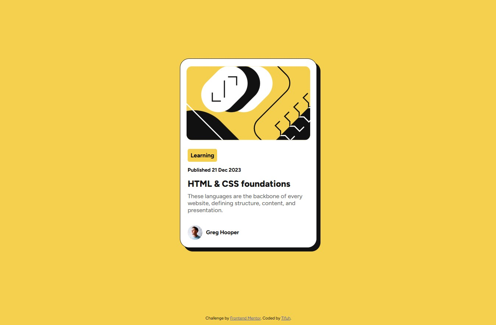

# Frontend Mentor - Blog preview card solution

This is a solution to the [Blog preview card challenge on Frontend Mentor](https://www.frontendmentor.io/challenges/blog-preview-card-ckPaj01IcS). Frontend Mentor challenges help you improve your coding skills by building realistic projects. 

 
## Table of contents
 
- [Overview](#overview)
  - [The challenge](#the-challenge)
  - [Screenshot](#screenshot)
  - [Links](#links)
- [My process](#my-process)
  - [Built with](#built-with)
  - [What I learned](#what-i-learned)
  - [Continued development](#continued-development)
  - [Useful resources](#useful-resources)
- [Author](#author)

## Overview

### The challenge

Users should be able to:

- See hover and focus states for all interactive elements on the page

### Screenshot



### Links
 
- Solution URL: [Github repo](https://github.com/Tifuh-n/practice-makes-progress/tree/main/blog-card)
- Live Site URL: [Add live site URL here](https://your-live-site-url.com)


## My process
 
### Built with
 
- Semantic HTML5 markup
- CSS custom properties (HSL color values)
- Flexbox
- Mobile-first workflow
- Google Fonts (Figtree)

### What I learned
 
Working through this challenge helped me get more comfortable with a few key techniques.
 
Using HSL color values made it easy to keep the colour palette consistent and readable throughout the stylesheet:
 
```css
background-color: hsl(47, 88%, 63%);
color: hsl(0, 0%, 7%);
```
 
I also practised centring a card both vertically and horizontally using Flexbox on the `body`, which is a pattern I'll keep reaching for:
 
```css
body {
  height: 100vh;
  display: flex;
  align-items: center;
  justify-content: center;
}
```
 
Adding the hard offset box shadow gave the card that distinctive Frontend Mentor look without needing any extra libraries:
 
```css
box-shadow: 10px 10px hsl(0, 0%, 7%);
```
 
### Continued development
 
In future projects I want to focus on:
 
- Implementing smooth hover and focus transitions with `transition` and `:hover` / `:focus-visible` so interactive states feel polished
- Exploring CSS Grid for more complex card layouts
- Improving accessibility by making sure all interactive elements are fully keyboard-navigable

### Useful resources
 
- [MDN – HSL color model](https://developer.mozilla.org/en-US/docs/Web/CSS/color_value/hsl) - Helped me understand how to work with HSL values to keep colours easy to tweak.
- [The Markdown Guide](https://www.markdownguide.org/) - Handy reference while writing this README.

## Author
 
- Frontend Mentor - [@Tifuh](https://www.frontendmentor.io/profile/Tifuh)
