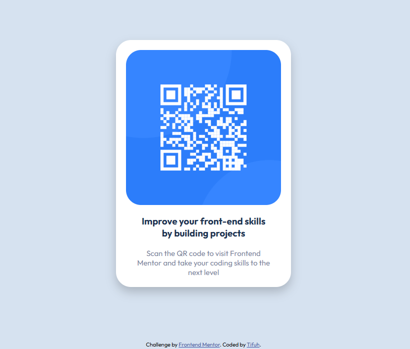

# Frontend Mentor - QR code component solution

This is a solution to the [QR code component challenge on Frontend Mentor](https://www.frontendmentor.io/challenges/qr-code-component-iux_sIO_H). Frontend Mentor challenges help you improve your coding skills by building realistic projects. 

## Table of contents

- [Overview](#overview)
  - [Screenshot](#screenshot)
  - [Links](#links)
- [My process](#my-process)
  - [Built with](#built-with)
  - [What I learned](#what-i-learned)
  - [Continued development](#continued-development)
  - [Useful resources](#useful-resources)
- [Author](#author)


## Overview

### Screenshot



### Links

- Solution URL: [Add solution URL here](https://your-solution-url.com)
- Live Site URL: [Add live site URL here]([https://your-live-site-url.com](https://qr-component-392o621qp-tifuh.vercel.app))

## My process

### Built with

- Semantic HTML5 markup
- Google fonts
- Flexbox


### What I learned

This project helped me strengthen my understanding of component-based design and responsive layouts. I practiced centering elements with Flexbox, styling text with semantic hierarchy, and creating a clean card layout with rounded corners and shadows.

#### A snippet I’m proud of is how I centered the component div in the viewport:

```css
.container{
    display: flex;
    align-items: center;
    justify-content: center;
    height: 100vh;
}
```

### Continued development

#### Going forward, I want to focus on:
1. Improving accessibility (ARIA labels, keyboard navigation, screen reader support).
2. Exploring CSS variables for theme management.
3. Practicing responsive design patterns for more complex layouts.


### Useful resources

- [W3Schools](https://www.w3schools.com/css/default.asp) - I use this as a reference for HTML and CSS code. Extremely helpful and always good to have on hand.

## Author

- Website - [Tifuh](https://www.your-site.com)
- Frontend Mentor - [@tifuh-n](https://www.frontendmentor.io/profile/tifuh-n)
- Twitter - [@tifuh_n](https://x.com/tifuh_n)
