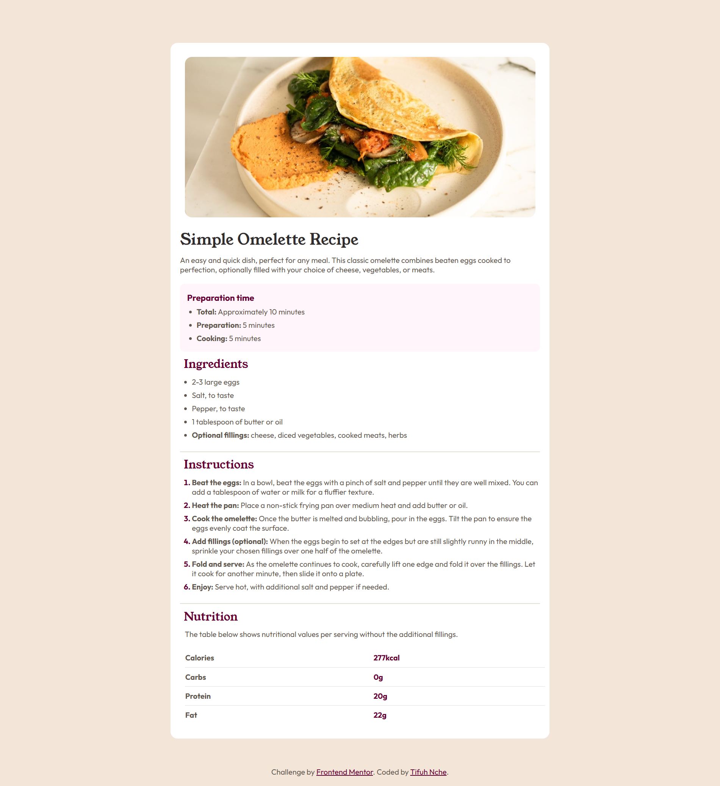

# Frontend Mentor - Recipe page solution

This is a solution to the [Recipe page challenge on Frontend Mentor](https://www.frontendmentor.io/challenges/recipe-page-KiTsR8QQKm). Frontend Mentor challenges help you improve your coding skills by building realistic projects. 

## Table of contents

- [Overview](#overview)
  - [The challenge](#the-challenge)
  - [Screenshot](#screenshot)
  - [Links](#links)
- [My process](#my-process)
  - [Built with](#built-with)
  - [What I learned](#what-i-learned)
  - [Useful resources](#useful-resources)
- [Author](#author)


## Overview

### Screenshot




### Links

- Solution URL: [Github Repo](https://github.com/Tifuh-n/practice-makes-progress/tree/main/recipe-page)
- Live Site URL: [Recipe Page Live](https://practice-makes-progress-2p1gdzhsn-tifuh.vercel.app/recipe-page/index.html)

## My process

### Built with

- Semantic HTML5 markup
- CSS custom properties
- Flexbox
- Pseudo-Classes

### What I learned

I learned how to style ordered and unordered list decorations which I had no idea was even possible:

```css
.instructions-list li::marker {
    color: hsl(330, 100%, 20%);
    font-weight: bold;
}
```
I also used the pseudo class nth-child() to edit the borders in the Nutrition table: 

```css
tr:last-child {
    border-bottom: none;
}
```


### Useful resources

- [W3Schools website](https://www.w3schools.com/html/default.asp) - Literally the go to place for everything HTML, CSS and more.
- [GoFullPage browser Extension](https://chromewebstore.google.com/detail/gofullpage-full-page-scre/fdpohaocaechififmbbbbbknoalclacl) - This helped me with screenshotting the full web page.

## Author

- Website - [Tifuh](https://practice-makes-progress-2p1gdzhsn-tifuh.vercel.app/)
- Frontend Mentor - [@Tifuh-n](https://www.frontendmentor.io/profile/Tifuh-n)
- Twitter - [@Tifuh_n](https://www.twitter.com/tifuh_n)
- Github - [Tifuh-n](https://github.com/Tifuh-n)
