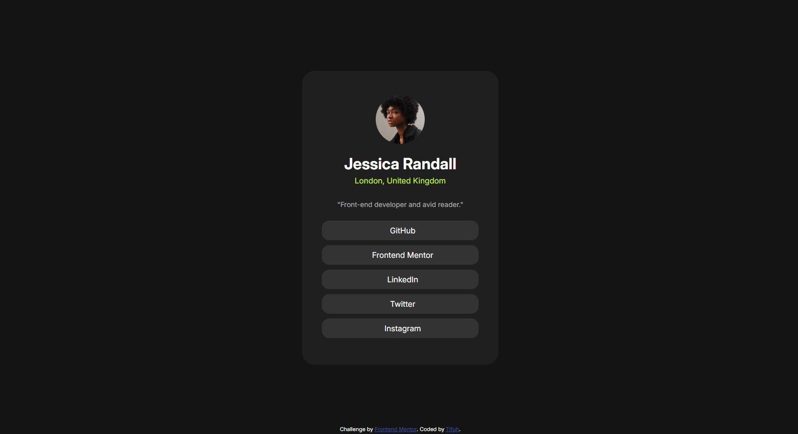

# Frontend Mentor - Social links profile solution

This is a solution to the [Social links profile challenge on Frontend Mentor](https://www.frontendmentor.io/challenges/social-links-profile-UG32l9m6dQ). Frontend Mentor challenges help you improve your coding skills by building realistic projects. 

## Table of contents
 
- [Overview](#overview)
  - [The challenge](#the-challenge)
  - [Screenshot](#screenshot)
  - [Links](#links)
- [My process](#my-process)
  - [Built with](#built-with)
  - [What I learned](#what-i-learned)
  - [Continued development](#continued-development)
- [Author](#author)
---
 
## Overview
 
### The challenge
 
Users should be able to:
 
- View a profile card with a name, location, bio, and social links
- See hover and focus states for all interactive elements on the page
### Screenshot
 

 
### Links
 
- Solution URL: [Add solution URL here](https://your-solution-url.com)
- Live Site URL: [Add live site URL here](https://your-live-site-url.com)
---
 
## My process
 
### Built with
 
- Semantic HTML5 markup
- CSS custom properties
- Flexbox
- [Inter](https://fonts.google.com/specimen/Inter) via Google Fonts
### What I learned
 
This project helped me practice centering layouts using Flexbox on both the `body` and the inner card container. A key takeaway was how to use `height: 100vh` on the body together with `display: flex`, `align-items: center`, and `justify-content: center` to perfectly center a card on the full viewport:
 
```css
body {
  height: 100vh;
  display: flex;
  align-items: center;
  justify-content: center;
}
```
 
I also reinforced the use of `border-radius: 50%` combined with `object-fit: cover` to display a circular profile image cleanly regardless of the source image's original dimensions:
 
```css
.profile-image img {
  border-radius: 50%;
  object-fit: cover;
  width: 100%;
  height: 100%;
}
```
 
Finally, I practiced applying hover states to anchor tags to improve interactivity, using a subtle background-color shift on the social link buttons:
 
```css
.social-link a:hover {
  background-color: hsl(0, 0%, 30%);
}
```
 
### Continued development
 
In future projects I want to focus on:
 
- Improving accessibility by ensuring all interactive elements have proper focus styles visible to keyboard users
- Exploring CSS transitions and animations to make hover effects smoother
- Practising responsive design more thoroughly so the card adapts gracefully on very small or very large screens
---
 
## Author
 
- Website - [Frontend Portfolio](https://practice-makes-progress-l2ieba2lc-tifuh.vercel.app)
- Frontend Mentor - [@Tifuh-n](https://www.frontendmentor.io/profile/Tifuh-n)
- Twitter - [@Tifuh_n](https://www.twitter.com/tifuh_n)